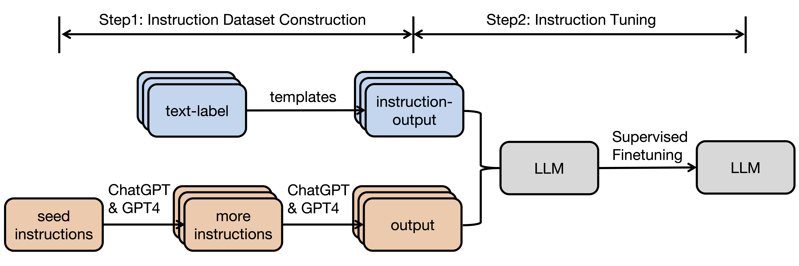

# Instruction-Tuning-Survey

This repository contains resources referenced in the paper [Instruction Tuning for Large Language Models: A Survey](https://arxiv.org/abs/2308.10792). 

If you find this repository helpful, please cite the following:
```latex
@article{zhang2023instruction,
  title={Instruction Tuning for Large Language Models: A Survey},
  author={Zhang, Shengyu and Dong, Linfeng and Li, Xiaoya and Zhang, Sen and Sun, Xiaofei and Wang, Shuhe and Li, Jiwei and Hu, Runyi and Zhang, Tianwei and Wu, Fei and others},
  journal={arXiv preprint arXiv:2308.10792},
  year={2023}
}
```

## Table of Contents 
* [Overview](#Overview)
* [Natural Language Instruction Tuning](Instruction-Tuned-LLMs)
  * [Datasets](#Datasets)
  * [Models](#Models)
* [Multi-modality Instruction Tuning](Multi-modality-Instruction-Tuning)
  * [Datasets](#Datasets)
  * [Models](#Models)
* [Domain-specific Instruction Tuning](Domain-specific-Instruction-Tuning)
  

## Overview

Instruction tuning (IT) refers to the process of further training large language models (LLMs) on a dataset consisting 
of `(instruction, output)` pairs
 in a supervised fashion, 
which bridges the gap between the next-word prediction objective of LLMs and the users' objective of having LLMs adhere 
to human instructions. The general pipeline of instruction tuning is shown in the following: 


In the [paper](https://arxiv.org/abs/2308.10792), we make a systematic review of the literature, including the general methodology of IT, 
the construction of IT datasets, the training of IT models, 
and applications to different modalities, domains and application, along with analysis on aspects that influence the outcome of IT (e.g., generation of instruction outputs, size of the instruction dataset, etc). We also 
review the potential pitfalls of IT along with criticism against it, along with efforts
pointing out current deficiencies of existing strategies and suggest some avenues for fruitful research.
The typology of the paper is as follows: 


## Natural Language Instruction Tuning

### Datasets 


### Models

| Instruction tuned LLMs | # Params | Github | Base Model ｜  Self-build Train | Train set | Size |
| ------|-----------|---------------------|-----------|- --------|-----------| --------|
| Instruct-GPT | 176B      | -  | GPT-3            | Yes    | -         | - | 
| BLOOMZ\tnotex{id:1} | 176B     |    [](https://huggingface.co/bigscience/bloomz)  | BLOOM           | No               | xP3       | -  | 
| FLAN-T5\tnotex{id:2} | 11B      |     []()    | T5         | No               | FLAN 2021 | - | 
| Alpaca\tnotex{id:3} | 7B       |    []()  | LLaMA           | Yes              | -         | 52K  | 
| Vicuna\tnotex{id:4} | 13B      |    []()   | LLaMA         | Yes              | -         | 70K  | 
| GPT-4-LLM\tnotex{id:5} | 7B       |     []()  | LLaMA           | Yes              | -         | 52K | 
| Claude~\citep{bai2022constitutional} | -       |     []()     | -             | Yes              | -         | - | 
| WizardLM\tnotex{id:6} | 7B      |    []()   | LLaMA            | Yes              | Evol-Instruct | 70K  | 
| ChatGLM2\tnotex{id:7}| 6B      |    []()   | GLM           | Yes              | -         | 1.1 Tokens | 
| LIMA | 65B      |    []()  | LLaMA              | Yes              | -         | 1K  | 
| OPT-IML \tnotex{id:8}| 175B    |    []()   | OPT           | No               | -         | - | 
| Dolly 2.0\tnotex{id:9} | 12B    |    []()    | Pythia         | No               | -         | 15K  | 
| Falcon-Instruct\tnotex{id:10}| 40B    |    []()    | Falcon       | No               | -         | - | 
| Guanaco\tnotex{id:11} | 7B     |    []()    | LLaMA         | Yes              | -         | 586K | 
| Minotaur\tnotex{id:12}| 15B      |    []()  | Starcoder Plus      | No               | -         | -  | 
| Nous-Hermes\tnotex{id:13}| 13B     |    []()   | LLaMA          | No               | -         | 300K+ | 
| TÜLU\tnotex{id:14} | 6.7B    |    []()   | OPT          | No               | Mixed     | - | 
| YuLan-Chat\tnotex{id:15}| 13B    |    []()    | LLaMA             | Yes              | -         | 250K  | 
| MOSS\tnotex{id:16} | 16B     |    []()   | -              | Yes              | -         | -  | 
| Airoboros\tnotex{id:17} | 13B    |    []()    | LLaMA        | Yes              | -         | -  | 
| UltraLM\tnotex{id:18}| 13B     |    []()   | LLaMA             | Yes              | -         | - | 

## Multi-modality Instruction Tuning

### Datasets

### Models

## Domain-specific Instruction Tuning


